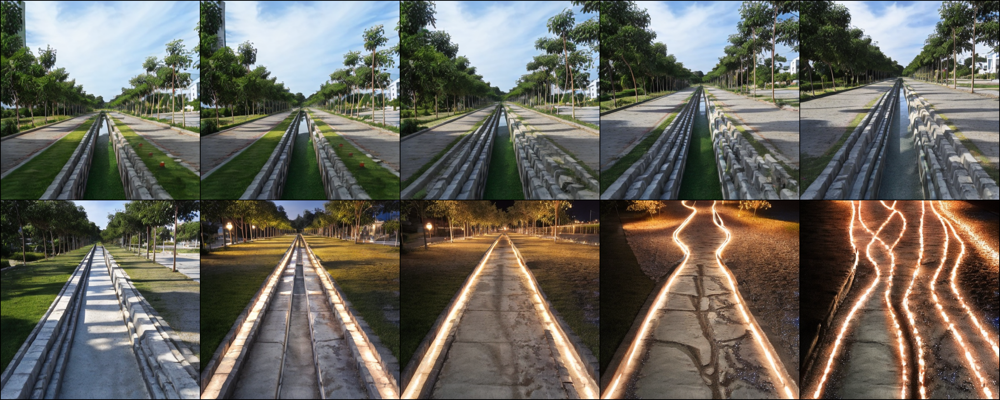

# CE6190 Image Editing Methods Benchmark

A benchmarking suite comparing state-of-the-art image editing methods using diffusion models. This project evaluates LEDITS++, LEDITS, and FastEdit across multiple datasets using perceptual similarity (LPIPS) and text-image alignment (CLIP Score) metrics.

## Team Members

- **Dutta Siddhant Shivshankar**
- **Dhea Pratama Novian Putra**
- **Naghshbandi Harir**
- **Skjöldur Orri Eyjólfsson**

## Project Overview

This project implements and benchmarks three cutting-edge image editing methods:

1. **LEDITS++** - Latest iteration with improved semantic guidance
2. **LEDITS** - Original DDPM inversion + SEGA approach
3. **FastEdit** - Rapid LoRA-based fine-tuning method

Each method is evaluated on two benchmark datasets using standardized metrics to provide objective comparisons of editing quality, semantic alignment, and image preservation. Below shows FastEdit output example:



## Repository Structure

```
.
├── leditspp.py              # LEDITS++ implementation
├── ledits.py                # Original LEDITS implementation  
├── fastedit.py              # FastEdit implementation
├── bench.py                 # Unified benchmarking framework
├── Demo_for_Presentation.ipynb  # Interactive Streamlit demo
├── requirements.txt         # Python dependencies
├── README.md               # This file
├── assets/                 # Dataset storage
│   ├── ourbench/          # Custom benchmark dataset
│   └── tedbench/          # TED benchmark dataset
├── outputs/               # Generated edited images
└── benchmark_results/     # CSV files with metrics
```

### File Descriptions

#### Core Implementation Files

**`leditspp.py`**
- Implements the LEDITS++ pipeline
- Uses the latest Diffusers implementation for improved semantic guidance
- Provides `LEDitsImageEditor` class with simple API
- Features inversion and editing in two steps
- Includes `edit_image_simple()` for one-line usage

**`ledits.py`**
- Original LEDITS implementation combining DDPM inversion and SEGA
- Contains `SemanticStableDiffusionPipeline` for SEGA guidance
- Implements custom DDPM inversion process
- `LEDITSEditor` class handles full editing pipeline
- More control over inversion parameters and momentum

**`fastedit.py`**
- FastEdit method using LoRA-based fine-tuning
- Rapid adaptation through parameter-efficient tuning
- Semantic similarity-based timestep selection
- Generates interpolation sequences between source and target
- Uses `FastEdit` class with integrated CLIP text encoder

#### Benchmarking and Evaluation

**`bench.py`**
- Unified benchmarking framework for all methods
- Computes LPIPS (perceptual similarity) scores
- Computes CLIP scores (text-image alignment)
- Supports multiple datasets and methods
- Automatic result aggregation and CSV export
- Includes logging to `logs/benchmark.log`

**Key Metrics:**
- **LPIPS** (Learned Perceptual Image Patch Similarity): Measures perceptual similarity - lower is better
- **CLIP Score**: Measures text-image alignment - higher is better

#### Demo and Utilities

**`Demo_for_Presentation.ipynb`**
- Interactive Streamlit web interface for LEDITS++
- Used for live demonstration during group presentation
- Provides GPU memory monitoring
- Real-time parameter adjustment
- Not required for benchmarking

**`requirements.txt`**
- All Python package dependencies
- Pinned versions for reproducibility
- Compatible with Python 3.10.19


## Setup Instructions

### 1. Environment Setup

Create a conda environment with Python 3.10:

```bash
conda create -n ce6190 python=3.10
conda activate ce6190
```

### 2. Install Dependencies

Install all required packages:

```bash
pip install -r requirements.txt
```

### 3. Dataset Preparation

Place your benchmark datasets in the `assets/` directory:

```
assets/
├── ourbench/
│   ├── images/           # Input images
│   └── dataset.json      # Metadata with prompts
└── tedbench/
    ├── images/           # Input images
    └── FastEdit.json     # Metadata with prompts
```

**Dataset JSON Format:**
```json
[
  {
    "img_name": "image001.jpg",
    "target_text": "cherry blossom"
  },
  ...
]
```


## Running the Benchmark

### Basic Usage

Run a single method on a single dataset:

```bash
python bench.py --method leditspp --dataset ourbench
```

### Available Options

**Methods:**
- `leditspp` - LEDITS++
- `ledits` - Original LEDITS
- `fastedit` - FastEdit

**Datasets:**
- `ourbench` - Custom benchmark
- `tedbench` - TED benchmark

### Advanced Usage

**Specify GPU device:**
```bash
python bench.py --method leditspp --dataset ourbench --device cuda:0
```

**Custom output directory:**
```bash
python bench.py --method leditspp --dataset ourbench --output-dir ./results
```

**Run all methods on all datasets:**
```bash
python bench.py
```

This will systematically benchmark every method on every dataset.


## Benchmark Output

### Generated Files

**Edited Images:**
- Saved to `outputs/{method}_{dataset}/`
- Named with UUID for uniqueness
- PNG format for lossless quality

**Benchmark Results:**
- CSV files in `benchmark_results/`
- Format: `{method}_clip_lpips_{dataset}.csv`
- Contains per-image metrics

**Example CSV Structure:**
```csv
image,prompt,lpips,clip_score
image001.jpg,cherry blossom,0.3421,0.7823
image002.jpg,snowy mountain,0.2891,0.8156
```

**Logs:**
- Detailed execution logs in `logs/benchmark.log`
- Includes timing and progress information

### Interpreting Results

**LPIPS Score:**
- Range: 0.0 to 1.0
- Lower = more similar to original (better preservation)
- Higher = more perceptual change

**CLIP Score:**
- Range: 0.0 to 1.0 (typically)
- Higher = better text-image alignment
- Indicates semantic accuracy of edit

**Ideal Results:**
- Moderate LPIPS (preserves image structure)
- High CLIP score (accurate to prompt)


## Hardware Requirements utilized

- GPU: NVIDIA A6000 (48GB VRAM)
- RAM: 32GB system memory